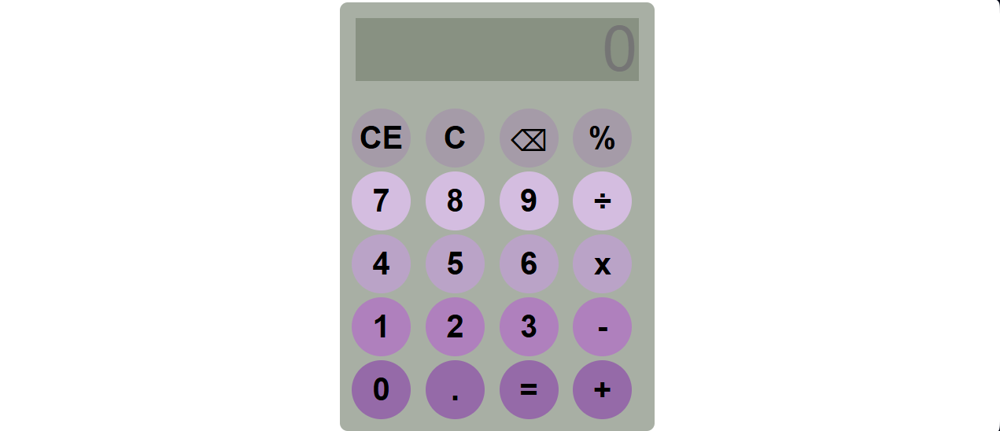

# Simple Calculator

A simple calculator built using HTML, CSS, and JavaScript. It supports basic arithmetic operations and provides a clean, minimalist user interface.

## Live Demo

🔗 https://jj-esp.github.io/Simple-Calculator/
[](https://jj-esp.github.io/Simple-Calculator/)

## Features

* Addition, subtraction, multiplication, and division
* Percentage calculations
* Clear (C) and Clear Entry (CE)
* Backspace/Delete functionality
* Repeat last operation by pressing "=" multiple times
* Responsive design
* Minimalist design

## Built With

* HTML5
* CSS3
* JavaScript (Vanilla JS)

## Project Structure

```text
Simple-Calculator/
│
├── index.html
├── style.css
├── script.js
├── screenshot.png
└── LICENSE
└── README.md

```

##  Installation

1. Clone the repository:

```bash
git clone https://github.com/jj-esp/Simple-Calculator.git
```

2. Open the project folder.

3. Open `index.html` in your browser.

##  Learning Goals

This project was created to practice:

* DOM manipulation
* Event handling
* JavaScript functions
* Regular expressions
* Git and GitHub workflows


## Future Improvements

* Keyboard support
* Calculation history
* Implement an operation-chaining display mode where completed expressions are stored internally, while only the current      operand is shown on the screen to maintain a clean and minimalist interface
* Restrict the display to show only a maximum of 9 characters at a time
* Improve the handling of decimal and long-number inputs
* Scientific calculator functions
* Theme switcher (light/dark mode)

## Author

Jessie James Espiritu

GitHub: https://github.com/jj-esp

## License

This project is licensed under the MIT License.
